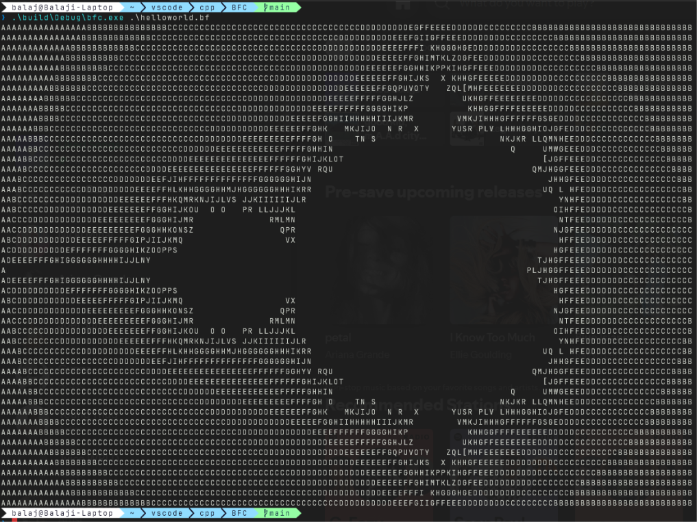

# Brainfuck Interpreter

A lightweight, simple [Brainfuck](https://wikipedia.org) interpreter built in **[Language Name]**. This project implements the classic esoteric programming language using a standard data array and pointers to execute code efficiently.

## 🚀 Getting Started

### Prerequisites

Make sure you have **[Prerequisite/Environment, e.g., Python 3.x / Node.js / GCC]** installed on your system.

### Installation

Clone the repository to your local machine:

```bash
git clone https://github.com
cd your-repo-name
```

## 🛠️ Usage

You can run your Brainfuck files or use the interactive REPL.

### Running a script:

```bash
[command] interpreter.py [path/to/script.bf]
```

### Examples

This repository includes a few sample Brainfuck scripts in the `/examples` folder. To run the classic "Hello World!" program:

```bash
[command] interpreter.py examples/hello_world.bf
```

## Output Example

Here is a quick preview of the interpreter successfully executing a Brainfuck script:



## Brainfuck Commands Reference

The interpreter supports all standard 8 commands:

- `>` : Increment the data pointer.
- `<` : Decrement the data pointer.
- `+` : Increment the byte at the data pointer.
- `-` : Decrement the byte at the data pointer.
- `.` : Output the byte at the data pointer.
- `,` : Accept one byte of input, storing its value in the byte at the data pointer.
- `[` : If the byte at the data pointer is zero, then instead of moving the instruction pointer forward to the next command, jump it forward to the command after the matching `]`.
- `]` : If the byte at the data pointer is nonzero, then instead of moving the instruction pointer forward to the next command, jump it back to the command after the matching `[`.

## License

This project is licensed under the MIT License - see the `LICENSE` file for details.
